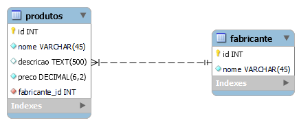

# exemplo-modelagem-de-dados
 Modelagem Lógica usando MySQL Workbench

Atividades de estudo de modelagem de banco de dados

## Exemplo de Modelagem Lógica

## Sobre tipos de relacionamentos

### 1:1

Relacionamento do tipo **1 para 1**.

### 1:n
Relacionamento do tipo **1 para n**, ou seja, **1 para  vários**

### n:m 
Relacionamento do tipo **n para m**, ou seja, **vários para  vários**

## Exercício resolvido:
